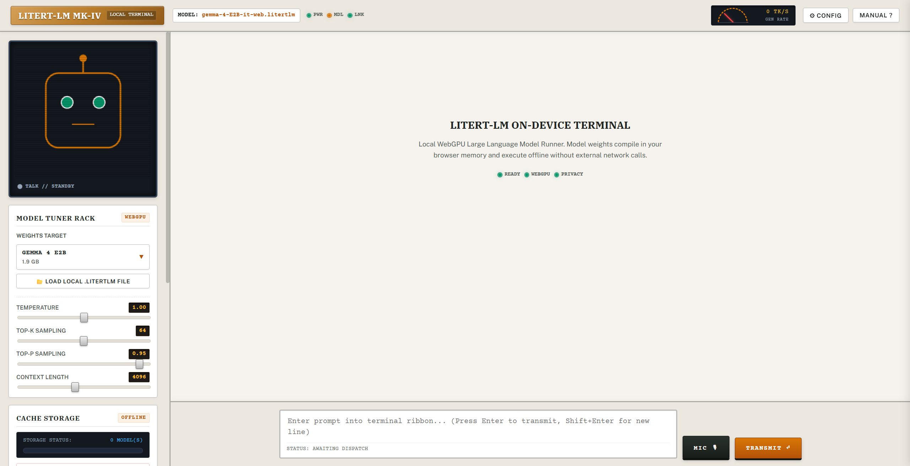
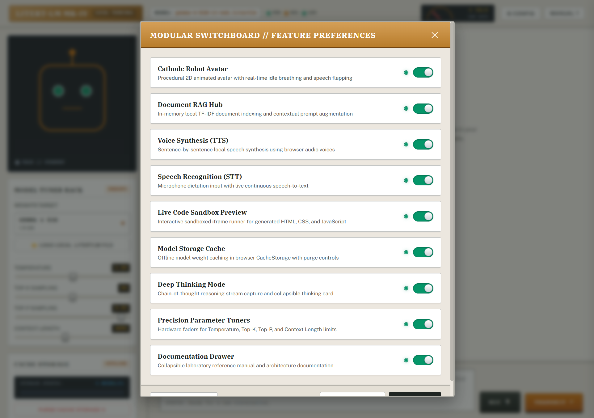
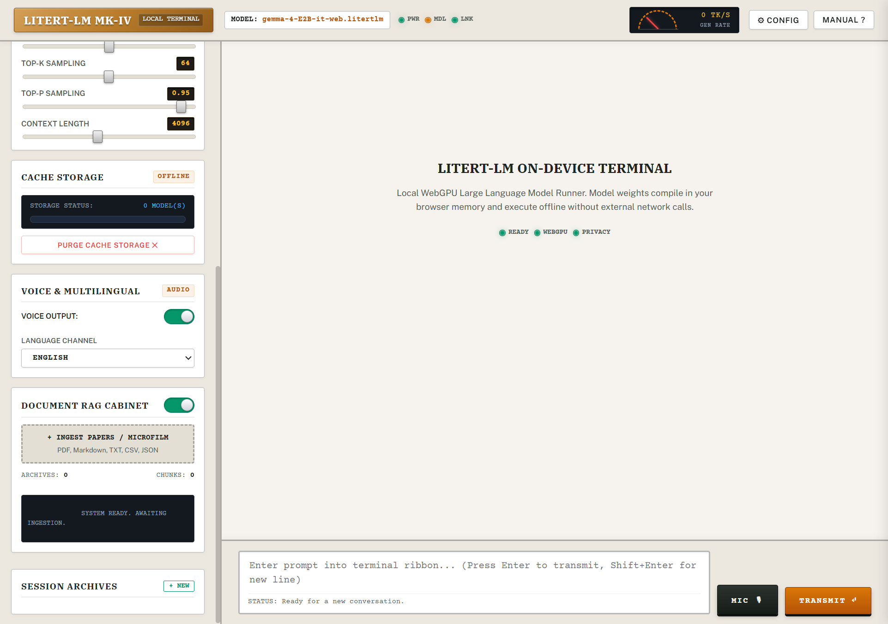
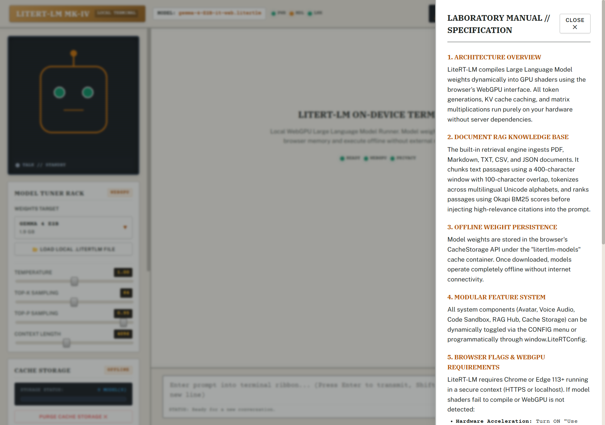

# Modelos pequeños y buen diseño: la IA en el navegador

Los artículos técnicos sobre inteligencia artificial contemporánea casi siempre parten del mismo supuesto de infraestructura: conseguir una clave de API, pagar por cada bloque de tokens consumido y enviar cualquier dato del usuario a un centro de procesamiento remoto. La literatura promocional abunda en titulares repetitivos del estilo diez cosas salvajes que puedes hacer con el último modelo, ignorando sistemáticamente los costes operativos, la latencia de red y los riesgos de gobernanza que implica depender de una nube ajena.

La suposición implícita de que nada útil puede construirse fuera de un clúster de cientos de miles de millones de parámetros es falsa. Cuando Chrome comenzó a desplegar APIs de IA integradas directamente en el cliente (primero con Gemini Nano y luego facilitando el acceso de bajo nivel a WebGPU con pesos abiertos como Gemma), quedó claro que la frontera del software de producción no está únicamente en la escala del cómputo remoto, sino en la descentralización de la inferencia.

## La arquitectura del cliente: WebGPU y modelos compactos

Ejecutar un modelo de lenguaje en el navegador sin intermediación de servidores ya no es una prueba de concepto teórica. Con modelos optimizados de unos 2.000 millones de parámetros (2B) y pesos que rondan 1,9 GB de descarga, el hardware del propio usuario es suficiente para sostener inferencia interactiva a decenas de tokens por segundo.

La clave técnica reside en WebGPU. A diferencia de las aproximaciones antiguas basadas en WebGL, WebGPU expone capacidades de cómputo paralelo (compute shaders) en lenguaje WGSL directamente a la GPU o NPU del dispositivo. El compilador en tiempo de ejecución de LiteRT compila las operaciones tensoriales, la multiplicación de matrices y la gestión de la memoria de claves y valores (KV-cache) en shaders nativos de la tarjeta gráfica, manteniendo el aislamiento y la seguridad que impone la sandbox del navegador.

## Diseño de sistemas vs. tamaño de parámetros

Existe una objeción comprensible: un modelo de 2B no razona hoy con la sofisticación abstracta de un modelo de 70B o de las arquitecturas de frontera cerradas. Si se expone un modelo pequeño ante una caja de texto vacía sin estructura, el resultado suele ser impreciso o superficial.

Sin embargo, la inmensa mayoría de las tareas de software cotidiano no exigen resolver teoremas matemáticos ni redactar disertaciones complejas. Exigen consultar documentos propios, extraer campos de un archivo estructurado, transcribir dictados de voz, comprobar la coherencia de un dato o generar fragmentos de código para previsualización inmediata.

En estos contextos, el cuello de botella rara vez es la capacidad bruta del modelo; el cuello de botella es el diseño del sistema que lo rodea. Un modelo pequeño respaldado por una interfaz deliberada, con herramientas locales de soporte y flujos acotados, supera en utilidad real y velocidad a un modelo masivo consumido a través de una API saturada.

## Modularidad y control del entorno de ejecución

En el desarrollo del terminal LiteRT-LM MK-IV se adoptó una filosofía modular explícita. Cada subsistema del software (la renderización visual, el motor de indexación, el pipeline de síntesis de audio, el sandbox de previsualización de código y la caché de almacenamiento) opera desacoplado del bucle principal de inferencia.

A través del panel de configuración modular, el usuario puede activar o desactivar cada subsistema de acuerdo con las restricciones de hardware del equipo:

- **Ajuste de hiperparámetros en tiempo real:** Control directo sobre Temperatura, Top-K, Top-P y longitud de ventana de contexto (hasta 4096 o 8192 tokens) mediante faders calibrados.
- **Telemetría de generación instantánea:** Monitorización continua de la tasa de tokens por segundo (TK/S) generada sobre la GPU local.
- **Sandbox de código en vivo:** Contenedor iframe con políticas de aislamiento de seguridad para renderizar HTML, SVG o JavaScript producido por el modelo en el acto.
- **Canal de audio bidireccional nativo:** Dictado por micrófono mediante SpeechRecognition y síntesis de voz en local por oraciones completas mediante SpeechSynthesis, con selector multilingüe y sin llamadas a APIs externas.

## Recuperación documental en memoria: RAG sin bases de datos remotas

Uno de los mayores errores en aplicaciones cliente de IA es pensar que la recuperación aumentada por generación (RAG) requiere obligatoriamente una base de datos vectorial en la nube, servicios de embedding remotos o infraestructura pesada. Para el trabajo con los documentos de un usuario individual (manuales, reportes financieros, notas legales o tablas de datos), esa arquitectura introduce una complejidad y un coste innecesarios, además de violar la privacidad básica de los datos.

El Gabinete RAG de LiteRT-LM resuelve este problema implementando un motor de indexación en memoria en el hilo del navegador. El mecanismo funciona de la siguiente manera:

- **Ingestión multiformato directa:** El usuario arrastra archivos PDF, Markdown, TXT, CSV o JSON al navegador sin transferir un solo byte fuera de su máquina.
- **Segmentación estructurada:** El texto se divide en fragmentos mediante una ventana deslizante de 400 caracteres con 100 caracteres de solapamiento para preservar el contexto entre párrafos.
- **Puntuación lexical con Okapi BM25:** El motor calcula frecuencias de términos y frecuencias inversas de documentos con normalización por longitud de fragmento, ordenando los pasajes por relevancia matemática exacta ante la consulta del usuario.
- **Inyección contextual de alta precisión:** Los fragmentos más relevantes se concatenan de forma estructurada en el prompt de Gemma. El modelo no necesita memorizar los datos: solo debe estructurar y responder basándose en el extracto exacto entregado.

Este diseño elimina por completo las alucinaciones habituales de los modelos pequeños cuando se les interroga sobre datos específicos, garantizando confidencialidad absoluta para información médica, contractual o empresarial sensible.

## Persistencia en disco y ejecución fuera de línea

Una aplicación de IA en el navegador no puede obligar al usuario a descargar 1,9 GB en cada recarga de página. LiteRT-LM utiliza la API CacheStorage del navegador bajo el contenedor litertlm-models para almacenar los pesos del modelo localmente de forma persistente.

En la primera visita se descargan y verifican los pesos comprimidos. Una vez registrados en la caché local, la aplicación puede funcionar completamente desconectada de internet. Adicionalmente, el sistema incluye soporte para cargar archivos de pesos binarios .litertlm directamente desde el almacenamiento local del usuario mediante la API de selección de archivos, permitiendo experimentar con checkpoints personalizados sin requerir ningún servidor HTTP.

## La barrera de distribución: por qué la web supera a la consola

Herramientas de línea de comandos como Ollama o llama.cpp representan avances técnicos notables y son indispensables en el flujo de trabajo de los desarrolladores. Sin embargo, tienen un techo de distribución insalvable para el público no especializado.

Un analista financiero, un médico en una clínica rural o un funcionario público no van a abrir una terminal de Linux, ni a lidiar con variables de entorno, ni a compilar controladores CUDA, ni a solicitar privilegios de administrador para instalar dependencias de bajo nivel. El navegador web elimina esa fricción de raíz: basta con abrir una URL en un navegador moderno para que el motor WebGPU acceda a la aceleración por hardware dentro de un entorno seguro y con aislamiento de procesos.

## Conclusión y banco de pruebas

El futuro del software inteligente no pertenece exclusivamente a modelos gigantescos alojados en centros de datos con facturación por token. La combinación de modelos abiertos compactos, aceleración WebGPU en el estándar web y un diseño riguroso de interfaces y herramientas permite construir herramientas potentes, privadas y gratuitas para el usuario final.

El terminal LiteRT-LM MK-IV está disponible como banco de pruebas interactivo y su código fuente es completamente abierto:

- **Terminal interactivo en vivo:** https://seagomezar.github.io/liteRT-LM/
- **Repositorio de código abierto:** https://github.com/seagomezar/liteRT-LM

